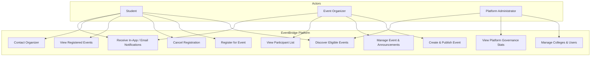
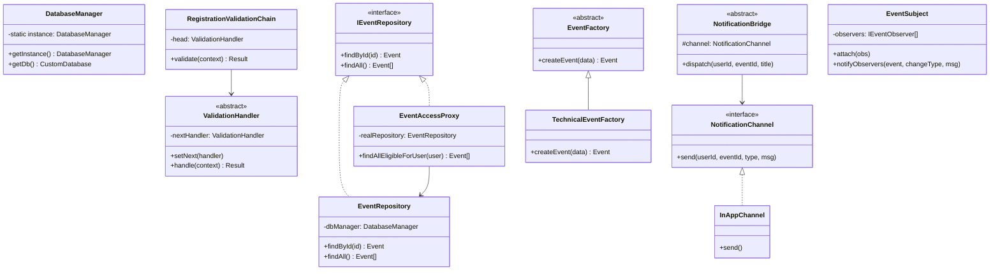
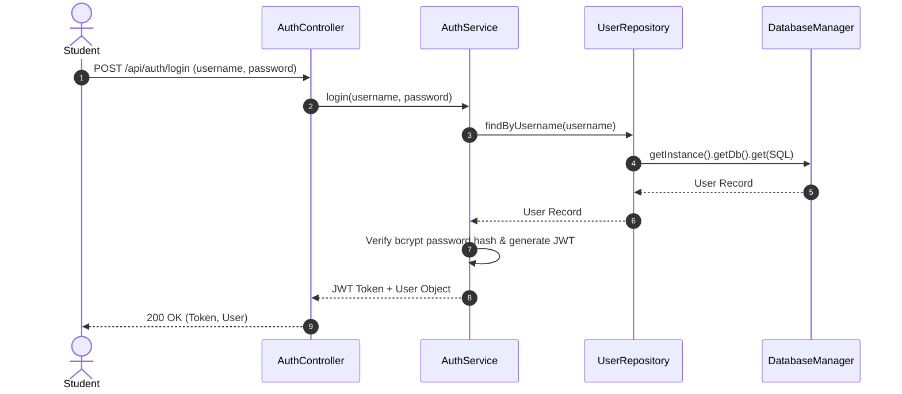
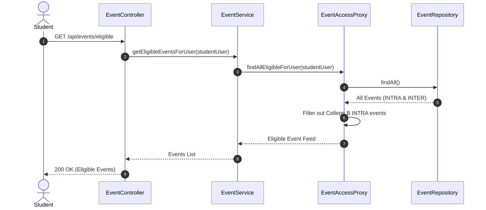
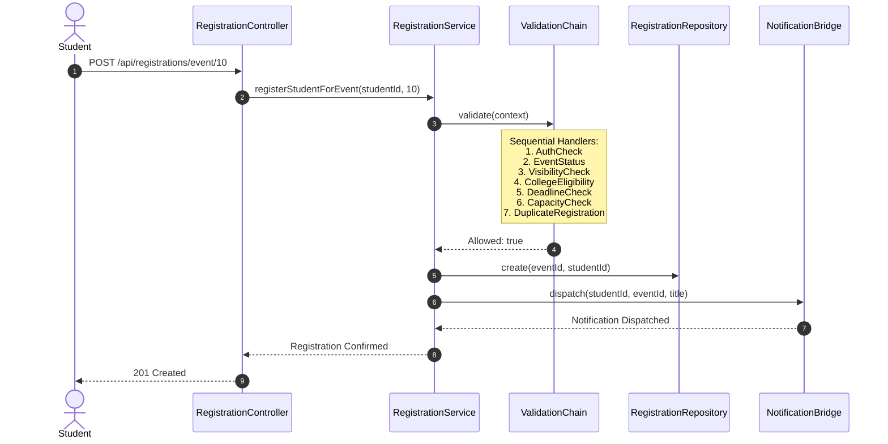
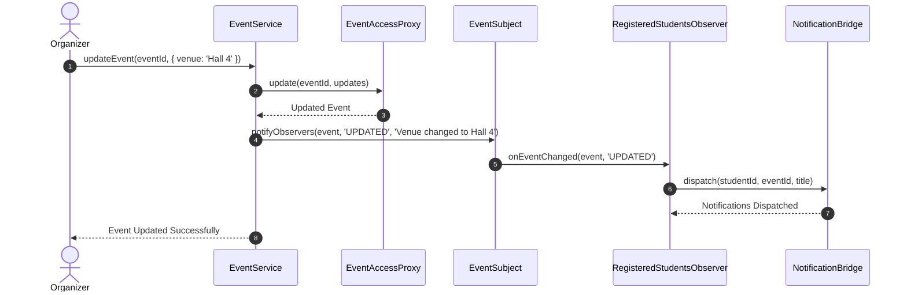
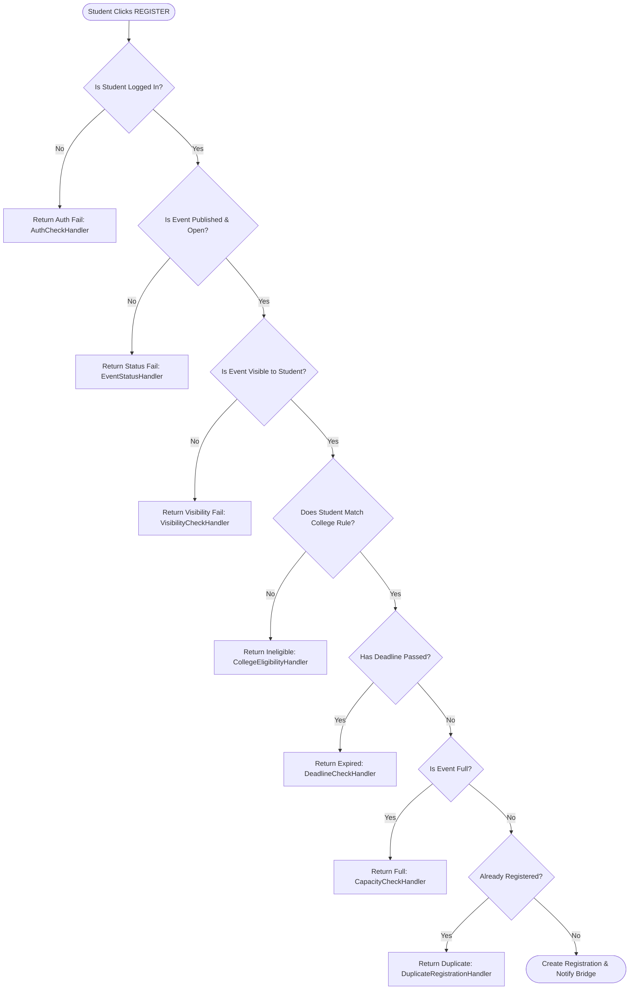
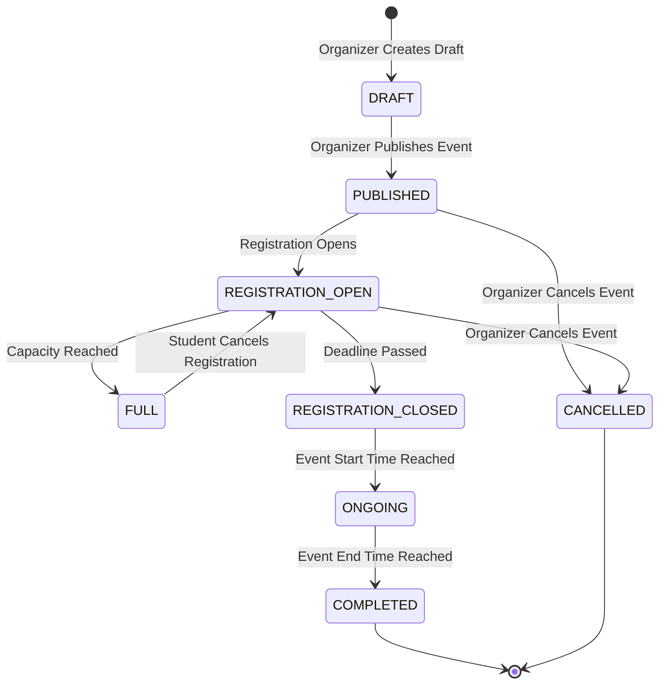
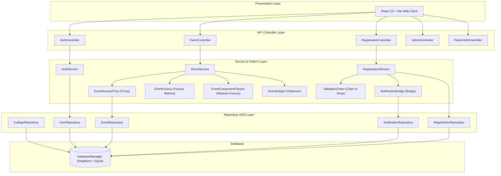
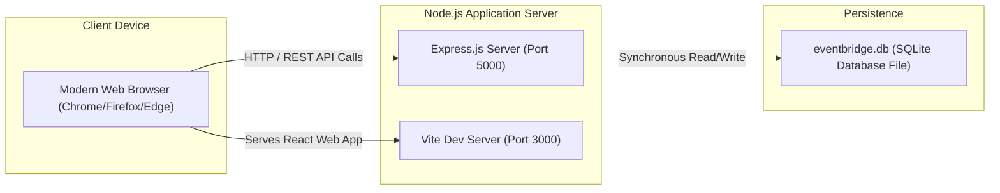

# EventBridge – Complete UML Diagram Specifications

This document provides formal Mermaid / PlantUML specifications for all 10 UML diagrams representing the EventBridge architecture.

---

## 1. Use Case Diagram

```mermaid
gantt
```


---

## 2. Class Diagram



---

## 3. Sequence Diagram – Student Login



---

## 4. Sequence Diagram – Event Discovery (Proxy Pattern)



---

## 5. Sequence Diagram – Registration Workflow (Chain of Responsibility)



---

## 6. Sequence Diagram – Event Update & Observer Pattern



---

## 7. Activity Diagram – Registration Workflow



---

## 8. State Diagram – Event Lifecycle



---

## 9. Component Diagram



---

## 10. Deployment Diagram


